# 🏗️ QuranBot Technical Architecture

*"And Allah has created every animal from water. Some of them walk on their bellies, some walk on two legs, and some walk on four. Allah creates what He wills. Allah has power over all things."* - **Quran 24:45**

## Overview

This document provides a comprehensive technical deep-dive into QuranBot's architecture, covering system design patterns, data flow, component interactions, and implementation details. The architecture follows Islamic principles of excellence (Ihsan) and service to the community.

---

## 🎯 Architectural Principles

### Core Design Philosophy

1. **Modularity**: Each component serves a specific Islamic purpose
2. **Reliability**: 24/7 service for the Muslim community
3. **Scalability**: Support for growing Islamic communities
4. **Maintainability**: Clean code following Islamic values of excellence
5. **Performance**: Efficient resource usage respecting creation

### Islamic Software Development Values

- **Ihsan (Excellence)**: Striving for the highest quality in code and service
- **Amanah (Trust)**: Reliable and secure handling of community data
- **Khidmah (Service)**: Prioritizing community benefit over technical complexity
- **Hikmah (Wisdom)**: Making thoughtful architectural decisions

---

## 🏛️ System Architecture Overview

### High-Level Architecture

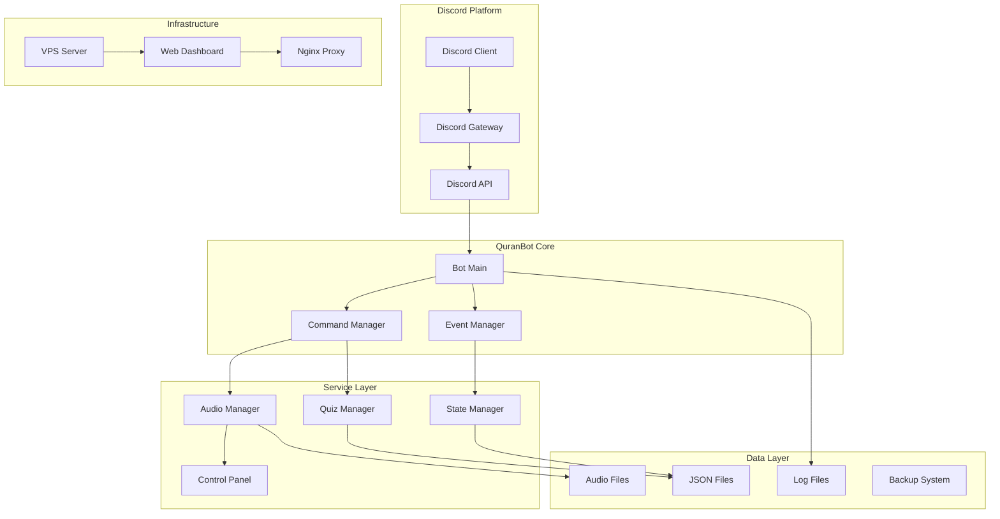

### Component Interaction Flow

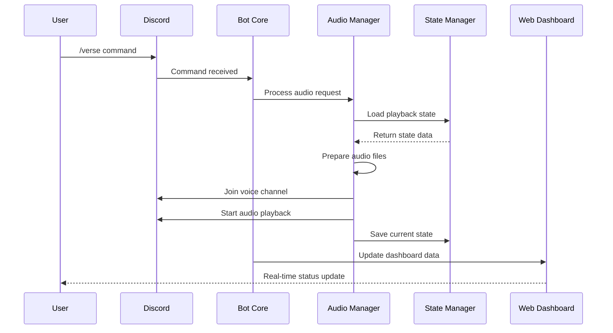

---

## 🧩 Core Components Architecture

### 1. Bot Core (`src/bot/main.py`)

#### Responsibilities
- Discord client initialization and management
- Event handling and command routing
- Global error handling and logging
- Service orchestration

#### Key Design Patterns

**Singleton Pattern**: Single bot instance per deployment
```python
class QuranBot:
    _instance = None
    
    def __new__(cls):
        if cls._instance is None:
            cls._instance = super().__new__(cls)
        return cls._instance
```

**Observer Pattern**: Event-driven architecture
```python
@bot.event
async def on_voice_state_update(member, before, after):
    """Observe voice state changes for role management"""
    await listening_stats_manager.handle_voice_state_change(member, before, after)
```

**Command Pattern**: Slash command handling
```python
@bot.tree.command(name="verse", description="Play Quranic verse")
async def verse_command(interaction: discord.Interaction, surah: int, ayah: int):
    """Encapsulate verse playback request"""
    await verse_handler.execute(interaction, surah, ayah)
```

#### Architecture Diagram

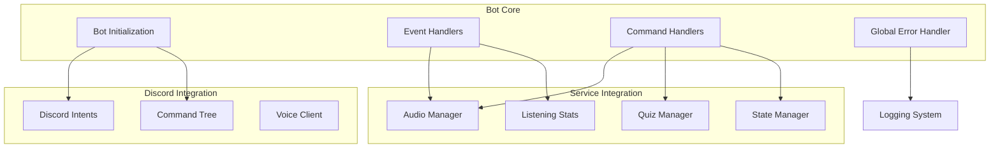

### 2. Audio Management System (`src/utils/audio_manager.py`)

#### Core Architecture

The audio system implements a sophisticated state machine for managing Quranic recitation playback:

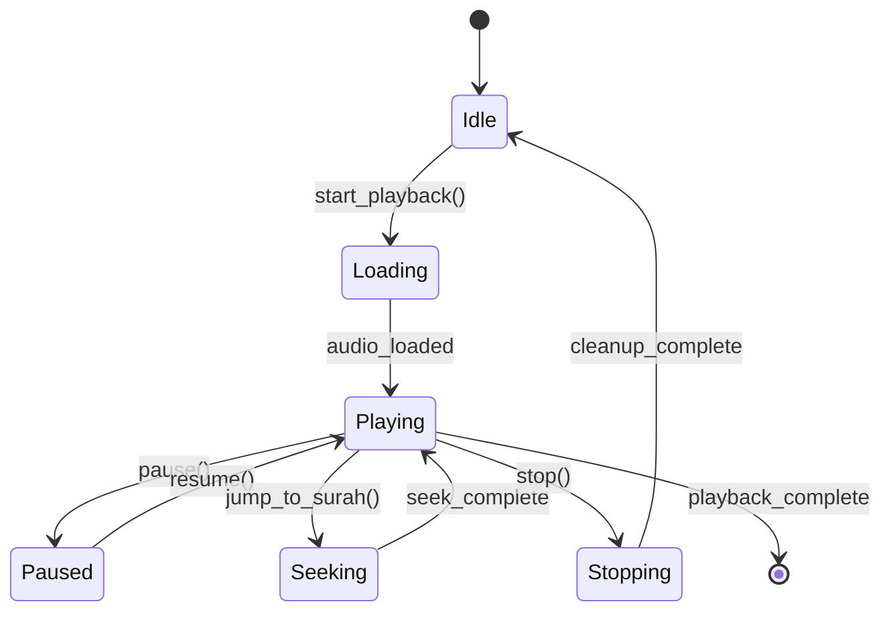

#### Key Components

**Position Tracking System**:
```python
class PositionTracker:
    """Real-time audio position tracking for resume functionality"""
    
    def __init__(self):
        self.track_start_time = None
        self.current_position = 0.0
        self.is_tracking = False
    
    async def start_tracking(self):
        """Begin position tracking loop"""
        while self.is_tracking:
            if self.track_start_time:
                elapsed = time.time() - self.track_start_time
                self.current_position = elapsed
            await asyncio.sleep(1)
```

**Multi-Reciter Support**:
```python
class ReciterManager:
    """Manages multiple Quranic reciters and audio sources"""
    
    def __init__(self, audio_base_folder: str):
        self.base_folder = Path(audio_base_folder)
        self.available_reciters = self._discover_reciters()
    
    def _discover_reciters(self) -> List[str]:
        """Dynamically discover available reciters from filesystem"""
        return [d.name for d in self.base_folder.iterdir() if d.is_dir()]
```

#### Data Flow Architecture

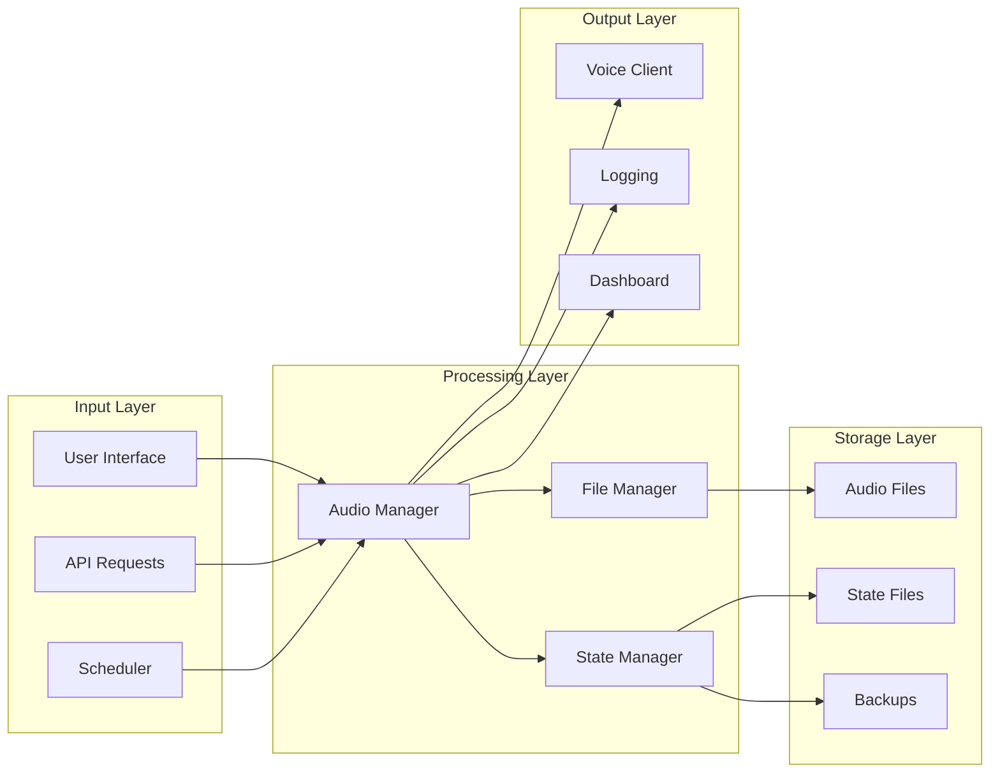

### 3. Quiz Management System (`src/utils/quiz_manager.py`)

#### Islamic Knowledge Architecture

The quiz system is designed around Islamic educational principles:

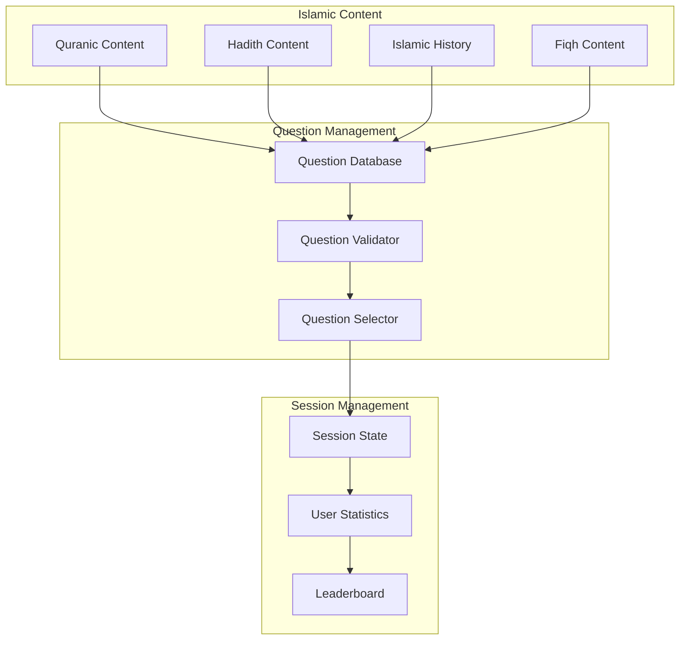

#### Question Data Structure

```python
@dataclass
class IslamicQuestion:
    """Structured representation of Islamic knowledge questions"""
    
    id: str
    category: QuestionCategory  # Quran, Hadith, Fiqh, History
    difficulty: DifficultyLevel  # Beginner, Intermediate, Advanced
    question: str
    choices: List[str]
    correct_answer: int
    explanation: Dict[str, str]  # Multi-language explanations
    references: List[str]  # Quranic verses, Hadith references
    tags: List[str]  # Topic classification
    
    def validate_islamic_content(self) -> bool:
        """Ensure content adheres to Islamic principles"""
        # Implementation for content validation
        pass
```

#### Scoring Algorithm

```python
class IslamicScoringSystem:
    """Implements Islamic education-focused scoring"""
    
    def calculate_score(self, 
                       correct: bool, 
                       difficulty: DifficultyLevel,
                       time_taken: float,
                       streak: int) -> int:
        """
        Calculate score based on Islamic learning principles
        - Rewards understanding over speed
        - Encourages consistent learning (streak bonus)
        - Balances difficulty appropriately
        """
        base_score = 10 if correct else 0
        difficulty_multiplier = {
            DifficultyLevel.BEGINNER: 1.0,
            DifficultyLevel.INTERMEDIATE: 1.5,
            DifficultyLevel.ADVANCED: 2.0
        }
        
        # Time bonus: reward thoughtful answers
        time_bonus = max(0, 30 - time_taken) / 30 * 5
        
        # Streak bonus: encourage consistent learning
        streak_bonus = min(streak * 2, 20)
        
        return int(base_score * difficulty_multiplier[difficulty] + 
                  time_bonus + streak_bonus)
```

### 4. State Management System (`src/utils/state_manager.py`)

#### Persistence Architecture

The state management system ensures data integrity and recovery:

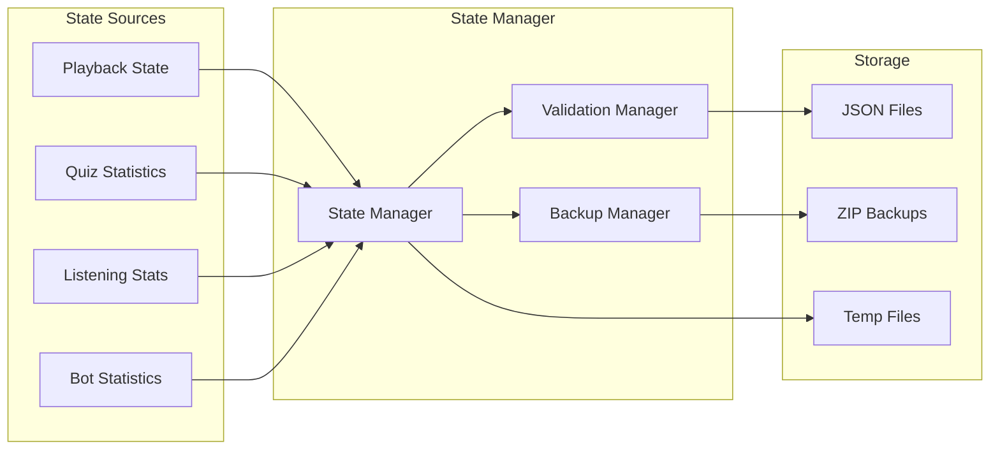

#### Atomic Operations

```python
class AtomicStateWriter:
    """Ensures atomic writes to prevent data corruption"""
    
    async def write_state(self, data: Dict, filepath: Path) -> bool:
        """
        Atomic write operation:
        1. Write to temporary file
        2. Validate written data
        3. Atomic rename to target file
        4. Create backup if needed
        """
        temp_file = filepath.with_suffix('.tmp')
        
        try:
            # Write to temporary file
            async with aiofiles.open(temp_file, 'w') as f:
                await f.write(json.dumps(data, indent=2))
            
            # Validate written data
            if await self._validate_json_file(temp_file):
                # Atomic rename
                temp_file.rename(filepath)
                return True
            else:
                temp_file.unlink()  # Remove invalid file
                return False
                
        except Exception as e:
            if temp_file.exists():
                temp_file.unlink()
            raise e
```

### 5. Web Dashboard Architecture (`vps/web_dashboard/app.py`)

#### Dashboard System Design

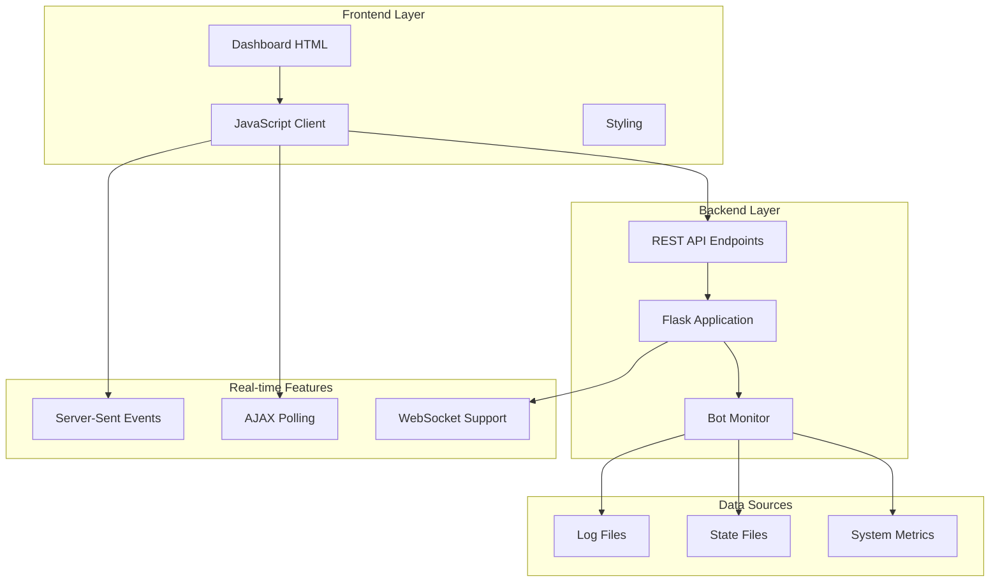

#### API Architecture

```python
class DashboardAPI:
    """RESTful API for dashboard functionality"""
    
    def __init__(self, bot_monitor: BotMonitor):
        self.monitor = bot_monitor
        self.app = Flask(__name__)
        self._register_routes()
    
    def _register_routes(self):
        """Register all API endpoints"""
        
        @self.app.route('/api/status')
        def get_bot_status():
            """Real-time bot status endpoint"""
            return jsonify(self.monitor.get_bot_status())
        
        @self.app.route('/api/audio')
        def get_audio_status():
            """Current audio playback status"""
            return jsonify(self.monitor.get_audio_status())
        
        @self.app.route('/api/leaderboard')
        def get_leaderboard():
            """Quiz leaderboard with Islamic context"""
            return jsonify(self.monitor.get_leaderboard())
```

---

## 📊 Data Architecture

### Data Flow Patterns

#### 1. Command Processing Flow

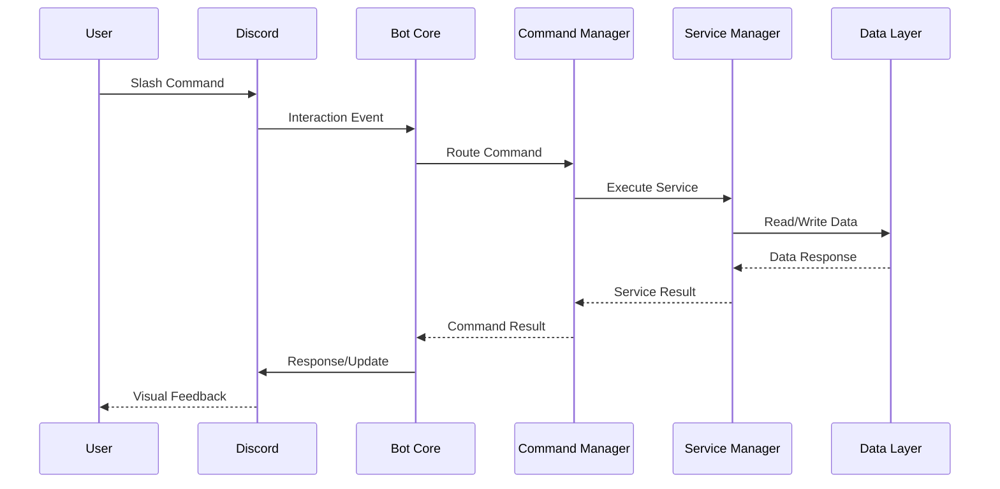

#### 2. Audio Streaming Flow

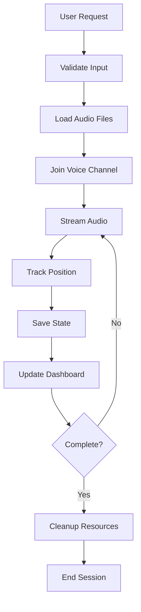

### Database Schema (JSON-based)

#### 1. Playback State Schema

```json
{
  "current_surah": 1,
  "current_position": 45.7,
  "current_reciter": "Saad Al Ghamdi",
  "is_playing": true,
  "loop_enabled": false,
  "shuffle_enabled": false,
  "timestamp": "2024-07-12T10:30:00Z",
  "session_id": "uuid-v4-string",
  "metadata": {
    "version": "3.5.0",
    "last_update_source": "audio_manager",
    "resume_position_accurate": true
  }
}
```

#### 2. Quiz Statistics Schema

```json
{
  "user_id": "123456789",
  "statistics": {
    "total_questions": 150,
    "correct_answers": 127,
    "accuracy_rate": 84.67,
    "current_streak": 12,
    "longest_streak": 25,
    "points": 2450,
    "rank": 3,
    "categories": {
      "quran": {"correct": 45, "total": 50},
      "hadith": {"correct": 38, "total": 45},
      "fiqh": {"correct": 28, "total": 35},
      "history": {"correct": 16, "total": 20}
    }
  },
  "achievements": [
    "first_correct_answer",
    "streak_master_10",
    "quran_expert"
  ],
  "last_activity": "2024-07-12T10:30:00Z"
}
```

#### 3. Listening Statistics Schema

```json
{
  "user_id": "123456789",
  "total_listening_time": 18450.5,
  "sessions": [
    {
      "start_time": "2024-07-12T09:00:00Z",
      "end_time": "2024-07-12T10:30:00Z",
      "duration": 5400,
      "surahs_listened": [1, 2, 3],
      "reciter": "Saad Al Ghamdi"
    }
  ],
  "favorite_surahs": [1, 2, 36, 55, 67],
  "favorite_reciters": ["Saad Al Ghamdi", "Abdul Basit"],
  "achievements": ["dedicated_listener", "night_prayer_companion"],
  "statistics": {
    "average_session_duration": 3600,
    "most_active_time": "fajr",
    "total_sessions": 45
  }
}
```

---

## 🔧 Technical Implementation Details

### Asynchronous Architecture

#### Event Loop Management

```python
class AsyncQuranBot:
    """Async-first architecture for optimal performance"""
    
    def __init__(self):
        self.loop = asyncio.get_event_loop()
        self.task_manager = TaskManager()
        self.services = {}
    
    async def start_services(self):
        """Start all bot services concurrently"""
        tasks = [
            self.task_manager.create_task(self._start_audio_service()),
            self.task_manager.create_task(self._start_quiz_service()),
            self.task_manager.create_task(self._start_monitoring_service()),
            self.task_manager.create_task(self._start_backup_service())
        ]
        
        await asyncio.gather(*tasks, return_exceptions=True)
```

#### Concurrent Task Management

```python
class TaskManager:
    """Manages concurrent tasks with proper lifecycle"""
    
    def __init__(self):
        self.tasks: Dict[str, asyncio.Task] = {}
        self.task_groups: Dict[str, List[asyncio.Task]] = {}
    
    def create_task(self, coro, name: str = None, group: str = None) -> asyncio.Task:
        """Create and track async task"""
        task = asyncio.create_task(coro)
        
        if name:
            self.tasks[name] = task
            task.add_done_callback(lambda t: self.tasks.pop(name, None))
        
        if group:
            if group not in self.task_groups:
                self.task_groups[group] = []
            self.task_groups[group].append(task)
        
        return task
    
    async def shutdown_group(self, group: str, timeout: float = 30):
        """Gracefully shutdown task group"""
        if group in self.task_groups:
            tasks = self.task_groups[group]
            for task in tasks:
                task.cancel()
            
            await asyncio.wait_for(
                asyncio.gather(*tasks, return_exceptions=True),
                timeout=timeout
            )
```

### Memory Management

#### Resource Pool Pattern

```python
class AudioResourcePool:
    """Manages audio processing resources efficiently"""
    
    def __init__(self, max_size: int = 10):
        self.max_size = max_size
        self.pool: asyncio.Queue = asyncio.Queue(maxsize=max_size)
        self.active_resources: Set[AudioResource] = set()
    
    async def acquire(self) -> AudioResource:
        """Acquire audio processing resource"""
        try:
            resource = self.pool.get_nowait()
        except asyncio.QueueEmpty:
            if len(self.active_resources) < self.max_size:
                resource = AudioResource()
            else:
                resource = await self.pool.get()
        
        self.active_resources.add(resource)
        return resource
    
    async def release(self, resource: AudioResource):
        """Release resource back to pool"""
        if resource in self.active_resources:
            self.active_resources.remove(resource)
            await resource.cleanup()
            try:
                self.pool.put_nowait(resource)
            except asyncio.QueueFull:
                # Pool is full, discard resource
                await resource.destroy()
```

### Error Handling Architecture

#### Hierarchical Error Handling

```python
class IslamicErrorHandler:
    """Islamic-values-based error handling system"""
    
    def __init__(self):
        self.error_handlers = {
            AudioError: self._handle_audio_error,
            QuizError: self._handle_quiz_error,
            StateError: self._handle_state_error,
            NetworkError: self._handle_network_error
        }
    
    async def handle_error(self, error: Exception, context: Dict[str, Any]):
        """Handle errors with Islamic principles of patience and wisdom"""
        
        # Log with Islamic context
        await self._log_with_islamic_context(error, context)
        
        # Attempt graceful recovery
        handler = self.error_handlers.get(type(error), self._handle_generic_error)
        recovery_successful = await handler(error, context)
        
        if not recovery_successful:
            # Escalate with du'a for guidance
            await self._escalate_with_guidance(error, context)
    
    async def _log_with_islamic_context(self, error: Exception, context: Dict[str, Any]):
        """Log errors with Islamic wisdom and patience"""
        log_perfect_tree_section(
            "Error Handled with Sabr (Patience)",
            [
                ("error_type", type(error).__name__),
                ("islamic_principle", "Every difficulty contains ease - Quran 94:6"),
                ("context", str(context)),
                ("recovery_attempt", "Seeking Allah's guidance")
            ],
            "🤲"
        )
```

### Security Architecture

#### Authentication and Authorization

```python
class IslamicSecurityManager:
    """Security management with Islamic principles"""
    
    def __init__(self):
        self.rate_limiters = {}
        self.access_controls = {}
        self.audit_logger = AuditLogger()
    
    async def validate_user_access(self, user_id: int, resource: str) -> bool:
        """
        Validate user access with Islamic principles of trust and responsibility
        """
        # Check rate limiting (preventing abuse)
        if not await self._check_rate_limit(user_id, resource):
            await self.audit_logger.log_rate_limit_exceeded(user_id, resource)
            return False
        
        # Check permissions (amanah - trust and responsibility)
        if not await self._check_permissions(user_id, resource):
            await self.audit_logger.log_access_denied(user_id, resource)
            return False
        
        # Log successful access
        await self.audit_logger.log_access_granted(user_id, resource)
        return True
    
    async def _check_rate_limit(self, user_id: int, resource: str) -> bool:
        """Implement rate limiting with Islamic moderation principles"""
        key = f"{user_id}:{resource}"
        
        if key not in self.rate_limiters:
            self.rate_limiters[key] = RateLimiter(
                max_requests=10,  # Moderate usage
                time_window=60,   # Per minute
                principle="moderation_in_all_things"
            )
        
        return await self.rate_limiters[key].allow_request()
```

---

## 🚀 Performance Architecture

### Caching Strategy

#### Multi-Layer Caching

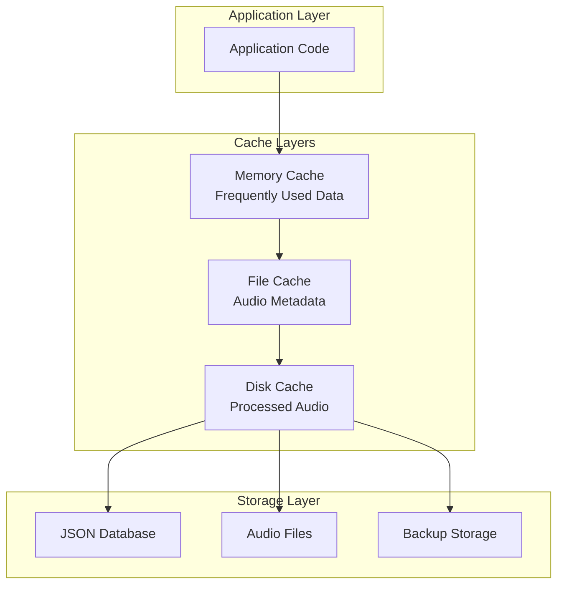

#### Cache Implementation

```python
class IslamicCacheManager:
    """Multi-layer caching with Islamic efficiency principles"""
    
    def __init__(self):
        self.memory_cache = TTLCache(maxsize=1000, ttl=300)  # 5 minutes
        self.file_cache = FileCache(cache_dir="cache/")
        self.metrics = CacheMetrics()
    
    async def get(self, key: str, fetch_func: Callable = None) -> Any:
        """
        Get data with cache hierarchy following Islamic efficiency
        "Allah loves, when one of you does a job, that he does it with excellence (ihsan)"
        """
        # L1: Memory cache (fastest)
        if key in self.memory_cache:
            self.metrics.record_hit('memory')
            return self.memory_cache[key]
        
        # L2: File cache
        file_data = await self.file_cache.get(key)
        if file_data is not None:
            self.memory_cache[key] = file_data
            self.metrics.record_hit('file')
            return file_data
        
        # L3: Fetch from source
        if fetch_func:
            data = await fetch_func()
            await self.set(key, data)
            self.metrics.record_miss()
            return data
        
        return None
    
    async def set(self, key: str, value: Any, ttl: int = None):
        """Set data in all cache layers"""
        self.memory_cache[key] = value
        await self.file_cache.set(key, value, ttl)
```

### Load Balancing and Scaling

#### Horizontal Scaling Architecture

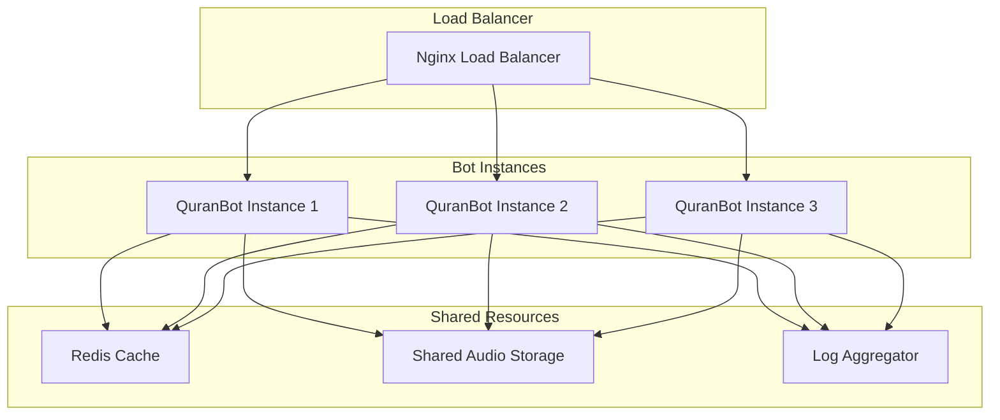

---

## 📊 Monitoring and Observability

### Metrics Collection Architecture

```python
class IslamicMetricsCollector:
    """Metrics collection with Islamic mindfulness"""
    
    def __init__(self):
        self.metrics = {
            'community_benefit': CommunityBenefitMetrics(),
            'system_health': SystemHealthMetrics(),
            'islamic_content': IslamicContentMetrics(),
            'user_engagement': UserEngagementMetrics()
        }
    
    async def collect_community_metrics(self):
        """Collect metrics focused on community benefit"""
        return {
            'quran_listening_hours': await self._get_total_listening_time(),
            'islamic_knowledge_shared': await self._get_quiz_questions_answered(),
            'community_growth': await self._get_user_growth_rate(),
            'spiritual_engagement': await self._get_spiritual_activity_score()
        }
    
    async def _get_spiritual_activity_score(self) -> float:
        """
        Calculate spiritual engagement score based on:
        - Quran listening consistency
        - Islamic quiz participation
        - Community interaction quality
        """
        listening_consistency = await self._calculate_listening_consistency()
        quiz_participation = await self._calculate_quiz_participation()
        community_interaction = await self._calculate_community_interaction()
        
        # Weighted score emphasizing spiritual growth
        return (
            listening_consistency * 0.5 +
            quiz_participation * 0.3 +
            community_interaction * 0.2
        )
```

### Logging Architecture

#### Structured Islamic Logging

```python
class IslamicLogger:
    """Logging system with Islamic context and values"""
    
    def __init__(self):
        self.tree_logger = TreeLogger()
        self.structured_logger = StructuredLogger()
        self.audit_logger = AuditLogger()
    
    async def log_community_action(self, 
                                 action: str, 
                                 user_id: int, 
                                 context: Dict[str, Any],
                                 islamic_context: str = None):
        """Log actions with Islamic mindfulness and community focus"""
        
        log_entry = {
            'timestamp': datetime.now(pytz.UTC).isoformat(),
            'action': action,
            'user_id': user_id,
            'context': context,
            'islamic_principle': islamic_context or self._get_relevant_principle(action),
            'community_impact': await self._assess_community_impact(action, context)
        }
        
        # Beautiful tree-style logging
        await self.tree_logger.log_perfect_tree_section(
            f"Community Action: {action}",
            [
                ("user", f"User {user_id}"),
                ("islamic_context", log_entry['islamic_principle']),
                ("community_benefit", log_entry['community_impact']),
                ("timestamp", log_entry['timestamp'])
            ],
            "🕌"
        )
        
        # Structured logging for analysis
        await self.structured_logger.log(log_entry)
        
        # Audit trail for accountability (amanah)
        await self.audit_logger.record_action(log_entry)
```

---

## 🔄 Deployment Architecture

### Infrastructure as Code

```yaml
# docker-compose.yml for Islamic bot deployment
version: '3.8'

services:
  quranbot:
    build: .
    environment:
      - ISLAMIC_PRINCIPLE=excellence_in_service
      - COMMUNITY_FOCUS=true
    volumes:
      - ./audio:/app/audio:ro
      - ./data:/app/data
      - ./logs:/app/logs
    restart: unless-stopped
    depends_on:
      - redis
      - monitoring
    
  dashboard:
    build: ./vps/web_dashboard
    ports:
      - "8080:8080"
    environment:
      - ISLAMIC_VALUES=true
      - COMMUNITY_SERVICE=enabled
    depends_on:
      - quranbot
    
  redis:
    image: redis:alpine
    command: redis-server --appendonly yes
    volumes:
      - redis_data:/data
    
  monitoring:
    image: prometheus:latest
    ports:
      - "9090:9090"
    volumes:
      - ./monitoring/prometheus.yml:/etc/prometheus/prometheus.yml
    
  nginx:
    image: nginx:alpine
    ports:
      - "80:80"
      - "443:443"
    volumes:
      - ./vps/nginx/nginx.conf:/etc/nginx/nginx.conf
    depends_on:
      - dashboard

volumes:
  redis_data:
```

### CI/CD Pipeline

```yaml
# .github/workflows/islamic-deployment.yml
name: Islamic Bot Deployment with Excellence (Ihsan)

on:
  push:
    branches: [main]
  pull_request:
    branches: [main]

jobs:
  islamic-quality-check:
    runs-on: ubuntu-latest
    steps:
      - name: Checkout with Basmala
        uses: actions/checkout@v3
        
      - name: Setup Python with Islamic Excellence
        uses: actions/setup-python@v4
        with:
          python-version: '3.11'
          
      - name: Install Dependencies with Trust (Amanah)
        run: |
          pip install -r requirements.txt
          pip install pytest black mypy
          
      - name: Code Quality Check (Ihsan)
        run: |
          black --check src/ tests/
          mypy src/
          
      - name: Islamic Content Validation
        run: |
          python tests/validate_islamic_content.py
          
      - name: Test with Community Focus
        run: |
          pytest tests/ -v --cov=src/
          
  deploy-with-wisdom:
    needs: islamic-quality-check
    runs-on: ubuntu-latest
    if: github.ref == 'refs/heads/main'
    steps:
      - name: Deploy to VPS with Barakah
        run: |
          echo "Deploying with Islamic principles of excellence and service"
          # Deployment script with Islamic mindfulness
```

---

## 🤲 Conclusion

This architecture embodies Islamic principles of excellence (Ihsan), trust (Amanah), and service (Khidmah) while providing a robust, scalable, and maintainable system for serving the Muslim community.

### Key Architectural Strengths

1. **Modular Design**: Each component serves a specific purpose in serving the community
2. **Reliability**: 24/7 operation ensuring continuous service
3. **Scalability**: Designed to grow with the Muslim community
4. **Performance**: Efficient resource usage respecting Allah's creation
5. **Security**: Protecting user data as a sacred trust (amanah)
6. **Maintainability**: Clean code following Islamic values of excellence

### Future Architectural Considerations

1. **Microservices Migration**: Breaking into smaller, focused services
2. **AI Integration**: Islamic Q&A and personalized learning
3. **Multi-language Support**: Serving the global Muslim community
4. **Mobile Architecture**: Native mobile app development
5. **Blockchain Integration**: Transparent donation and zakat systems

---

*"And Allah loves those who do good with excellence (ihsan)."* - **Quran 2:195**

May this architecture serve as a foundation for continuous improvement and benefit to the Muslim ummah worldwide. Every line of code written with Islamic consciousness becomes an act of worship and service to the community.

**"And whoever does good deeds, whether male or female, while being a believer - those will enter Paradise and will not be wronged even as much as the speck on a date seed."** - *Quran 4:124* 