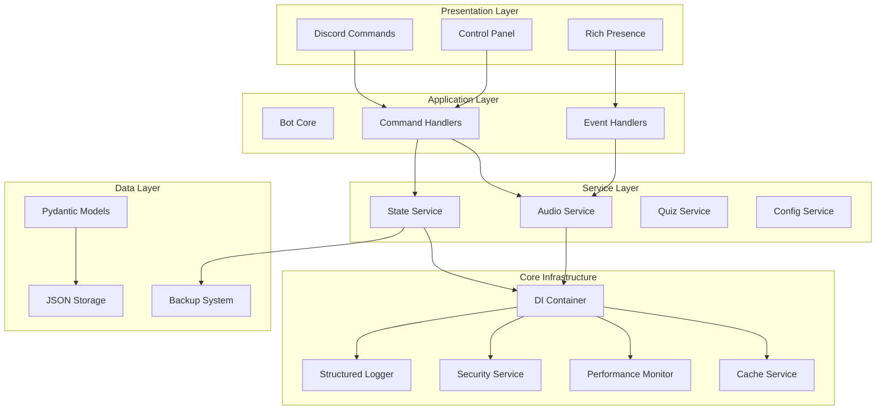
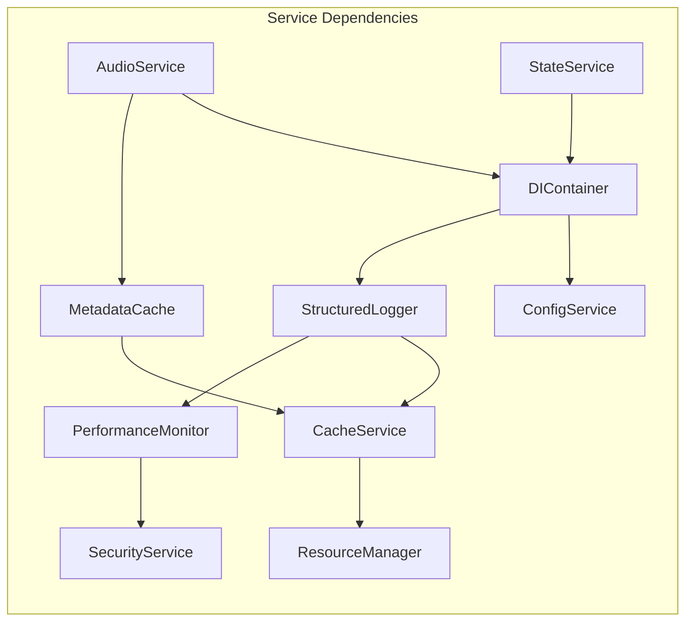

# 🏗️ QuranBot Service Architecture Documentation

This document provides comprehensive documentation of the modernized QuranBot service architecture, dependency injection system, and service interactions.

## 📋 Table of Contents

- [Architecture Overview](#architecture-overview)
- [Dependency Injection System](#dependency-injection-system)
- [Core Services](#core-services)
- [Modern Services](#modern-services)
- [Data Models](#data-models)
- [Service Lifecycle](#service-lifecycle)
- [Error Handling](#error-handling)
- [Performance Monitoring](#performance-monitoring)
- [Testing Architecture](#testing-architecture)

## 🎯 Architecture Overview

### **Layered Architecture**

The modernized QuranBot follows a clean layered architecture with clear separation of concerns:



### **Service Dependencies**



## 🔧 Dependency Injection System

### **DIContainer Implementation**

The `DIContainer` is the heart of the modernized architecture, managing service lifecycle and dependencies:

```python
from typing import TypeVar, Type, Dict, Any, Callable
from abc import ABC, abstractmethod

T = TypeVar('T')

class DIContainer:
    """
    Dependency Injection Container for service management.

    Features:
    - Singleton and transient service registration
    - Automatic dependency resolution
    - Service lifecycle management
    - Type-safe service retrieval
    """

    def __init__(self):
        self._singletons: Dict[Type, Any] = {}
        self._transient_factories: Dict[Type, Callable] = {}
        self._initialization_order: List[Type] = []

    def register_singleton(self, interface: Type[T], instance_or_factory: Any) -> None:
        """Register a singleton service."""
        if callable(instance_or_factory) and not isinstance(instance_or_factory, type):
            # Factory function
            self._singletons[interface] = instance_or_factory()
        else:
            # Direct instance
            self._singletons[interface] = instance_or_factory

        self._initialization_order.append(interface)

    def register_transient(self, interface: Type[T], factory: Callable[[], T]) -> None:
        """Register a transient service factory."""
        self._transient_factories[interface] = factory

    def get(self, interface: Type[T]) -> T:
        """Resolve a service instance."""
        # Check singletons first
        if interface in self._singletons:
            return self._singletons[interface]

        # Check transient factories
        if interface in self._transient_factories:
            return self._transient_factories[interface]()

        raise ServiceNotRegisteredError(f"Service {interface.__name__} not registered")

    def has(self, interface: Type[T]) -> bool:
        """Check if a service is registered."""
        return interface in self._singletons or interface in self._transient_factories

    async def initialize_all(self) -> bool:
        """Initialize all registered services in order."""
        for service_type in self._initialization_order:
            service = self.get(service_type)
            if hasattr(service, 'initialize'):
                success = await service.initialize()
                if not success:
                    return False
        return True

    async def shutdown_all(self) -> None:
        """Shutdown all services in reverse order."""
        for service_type in reversed(self._initialization_order):
            service = self.get(service_type)
            if hasattr(service, 'shutdown'):
                await service.shutdown()
```

### **Service Registration Pattern**

Services are registered during application startup:

```python
async def setup_services(container: DIContainer) -> bool:
    """Setup all services with proper dependencies."""

    # 1. Configuration (no dependencies)
    config_service = ConfigService()
    container.register_singleton(ConfigService, config_service)
    container.register_singleton(BotConfig, config_service.config)

    # 2. Core Infrastructure Services
    logger_factory = lambda: StructuredLogger(
        name="quranbot",
        level="INFO",
        log_file=Path("logs/quranbot.log")
    )
    container.register_singleton(StructuredLogger, logger_factory)

    cache_factory = lambda: CacheService(
        container=container,
        config=CacheConfig(),
        logger=container.get(StructuredLogger)
    )
    container.register_singleton(CacheService, cache_factory)

    # 3. Modern Services (depend on core services)
    audio_factory = lambda: AudioService(
        container=container,
        bot=container.get(commands.Bot),
        config=AudioServiceConfig(),
        logger=container.get(StructuredLogger),
        metadata_cache=container.get(MetadataCache)
    )
    container.register_singleton(AudioService, audio_factory)

    # 4. Initialize all services
    return await container.initialize_all()
```

## 🛠️ Core Services

### **StructuredLogger**

Provides JSON-based structured logging with correlation IDs:

```python
class StructuredLogger:
    """
    Structured logging service with correlation ID support.

    Features:
    - JSON-formatted log entries
    - Correlation ID tracking
    - Multiple output targets (file, console, webhook)
    - Performance metrics integration
    """

    def __init__(self, name: str, level: str, log_file: Path):
        self.name = name
        self.logger = logging.getLogger(name)
        self._setup_handlers(level, log_file)

    async def info(self, message: str, context: Dict[str, Any] = None):
        """Log info message with structured context."""
        await self._log(logging.INFO, message, context)

    async def error(self, message: str, context: Dict[str, Any] = None):
        """Log error message with structured context."""
        await self._log(logging.ERROR, message, context)

    async def _log(self, level: int, message: str, context: Dict[str, Any] = None):
        """Internal structured logging method."""
        log_entry = {
            'timestamp': datetime.utcnow().isoformat(),
            'level': logging.getLevelName(level),
            'message': message,
            'correlation_id': correlation_id.get(),
            'service': self.name,
            'context': context or {}
        }

        self.logger.log(level, json.dumps(log_entry))
```

### **CacheService**

Multi-strategy caching with persistence:

```python
class CacheService:
    """
    Multi-strategy caching service.

    Strategies:
    - LRU (Least Recently Used)
    - TTL (Time To Live)
    - LFU (Least Frequently Used)

    Features:
    - Configurable cache strategies
    - Persistence to disk
    - Cache metrics and monitoring
    - Automatic cleanup
    """

    def __init__(self, container: DIContainer, config: CacheConfig, logger: StructuredLogger):
        self.container = container
        self.config = config
        self.logger = logger
        self._cache = self._create_cache()
        self._metrics = CacheMetrics()

    async def get(self, key: str) -> Optional[Any]:
        """Get value from cache."""
        try:
            value = self._cache.get(key)
            if value is not None:
                self._metrics.record_hit()
                await self.logger.debug("Cache hit", {"key": key})
                return value
            else:
                self._metrics.record_miss()
                await self.logger.debug("Cache miss", {"key": key})
                return None
        except Exception as e:
            await self.logger.error("Cache get error", {"key": key, "error": str(e)})
            return None

    async def set(self, key: str, value: Any, ttl: Optional[int] = None) -> bool:
        """Set value in cache."""
        try:
            if ttl:
                self._cache.set(key, value, expire=ttl)
            else:
                self._cache[key] = value

            await self.logger.debug("Cache set", {"key": key, "ttl": ttl})
            return True
        except Exception as e:
            await self.logger.error("Cache set error", {"key": key, "error": str(e)})
            return False
```

### **PerformanceMonitor**

Real-time performance monitoring and metrics:

```python
class PerformanceMonitor:
    """
    Performance monitoring service.

    Features:
    - System metrics (CPU, memory, disk)
    - Application metrics (response times, throughput)
    - Performance profiling
    - Alerting on thresholds
    """

    def __init__(self, container: DIContainer, logger: StructuredLogger):
        self.container = container
        self.logger = logger
        self._metrics = {}
        self._profiler = None
        self._monitoring_task = None

    async def initialize(self) -> bool:
        """Initialize performance monitoring."""
        try:
            self._monitoring_task = asyncio.create_task(self._monitoring_loop())
            await self.logger.info("Performance monitoring started")
            return True
        except Exception as e:
            await self.logger.error("Performance monitor initialization failed", {"error": str(e)})
            return False

    async def get_system_metrics(self) -> SystemMetrics:
        """Get current system performance metrics."""
        import psutil

        return SystemMetrics(
            cpu_percent=psutil.cpu_percent(),
            memory_percent=psutil.virtual_memory().percent,
            disk_percent=psutil.disk_usage('/').percent,
            network_io=psutil.net_io_counters(),
            timestamp=datetime.utcnow()
        )

    @contextmanager
    def profile_context(self, operation_name: str):
        """Context manager for profiling operations."""
        start_time = time.time()
        try:
            yield
        finally:
            duration = time.time() - start_time
            asyncio.create_task(self._record_operation_time(operation_name, duration))
```

## 🎵 Modern Services

### **AudioService**

Enterprise-grade audio processing with dependency injection:

```python
class AudioService:
    """
    Modern audio service with dependency injection.

    Features:
    - Automatic voice channel connection
    - Resume from exact position
    - Multiple reciter support
    - Caching and metadata management
    - Performance monitoring integration
    """

    def __init__(self,
                 container: DIContainer,
                 bot: commands.Bot,
                 config: AudioServiceConfig,
                 logger: StructuredLogger,
                 metadata_cache: MetadataCache):
        self.container = container
        self.bot = bot
        self.config = config
        self.logger = logger
        self.metadata_cache = metadata_cache
        self._current_state = PlaybackState()
        self._voice_client = None

    async def initialize(self) -> bool:
        """Initialize audio service."""
        try:
            # Load available reciters
            await self._discover_reciters()

            # Load previous state
            state_service = self.container.get(StateService)
            saved_state = await state_service.load_playback_state()
            if saved_state:
                self._current_state = saved_state

            await self.logger.info("AudioService initialized", {
                "reciters_count": len(self._available_reciters),
                "current_surah": self._current_state.current_position.surah_number
            })
            return True
        except Exception as e:
            await self.logger.error("AudioService initialization failed", {"error": str(e)})
            return False

    async def start_playback(self, resume_position: bool = True) -> bool:
        """Start audio playback with optional resume."""
        try:
            # Get performance monitor for profiling
            perf_monitor = self.container.get(PerformanceMonitor)

            with perf_monitor.profile_context("audio_start_playback"):
                # Connect to voice channel if not connected
                if not self._voice_client or not self._voice_client.is_connected():
                    connected = await self._connect_to_voice_channel()
                    if not connected:
                        return False

                # Load audio file
                audio_file = await self._get_audio_file()
                if not audio_file:
                    return False

                # Start playback
                if resume_position and self._current_state.current_position.position_seconds > 0:
                    # Resume from saved position
                    await self._resume_from_position()
                else:
                    # Start from beginning
                    await self._start_from_beginning()

                # Update state
                self._current_state.is_playing = True
                self._current_state.is_paused = False

                # Save state
                await self._save_state()

                await self.logger.info("Audio playback started", {
                    "surah": self._current_state.current_position.surah_number,
                    "reciter": self._current_state.current_reciter,
                    "resume_position": resume_position
                })

                return True

        except Exception as e:
            await self.logger.error("Failed to start playback", {"error": str(e)})
            return False
```

### **StateService**

Advanced state management with backup and validation:

```python
class StateService:
    """
    State management service with backup and validation.

    Features:
    - Atomic state operations
    - Automatic backups
    - Data validation with Pydantic
    - Corruption recovery
    - State versioning
    """

    def __init__(self,
                 container: DIContainer,
                 config: StateServiceConfig,
                 logger: StructuredLogger):
        self.container = container
        self.config = config
        self.logger = logger
        self._backup_manager = None

    async def initialize(self) -> bool:
        """Initialize state service."""
        try:
            # Create directories
            self.config.data_directory.mkdir(exist_ok=True)
            self.config.backup_directory.mkdir(exist_ok=True)

            # Initialize backup manager
            self._backup_manager = BackupManager(
                data_dir=self.config.data_directory,
                backup_dir=self.config.backup_directory,
                logger=self.logger
            )

            await self.logger.info("StateService initialized")
            return True
        except Exception as e:
            await self.logger.error("StateService initialization failed", {"error": str(e)})
            return False

    async def save_playback_state(self, state: PlaybackState) -> bool:
        """Save playback state with validation and backup."""
        try:
            # Validate state
            if not self._validate_playback_state(state):
                return False

            file_path = self.config.data_directory / "playback_state.json"

            # Create backup before saving
            if file_path.exists():
                await self._backup_manager.create_backup(file_path)

            # Atomic write
            success = await self._atomic_write(file_path, state.dict())

            if success:
                await self.logger.info("Playback state saved", {
                    "surah": state.current_position.surah_number,
                    "position": state.current_position.position_seconds
                })

            return success

        except Exception as e:
            await self.logger.error("Failed to save playback state", {"error": str(e)})
            return False

    async def _atomic_write(self, file_path: Path, data: Dict[str, Any]) -> bool:
        """Perform atomic write operation."""
        temp_file = file_path.with_suffix('.tmp')

        try:
            # Write to temporary file
            async with aiofiles.open(temp_file, 'w') as f:
                await f.write(json.dumps(data, indent=2, default=str))

            # Validate written file
            if await self._validate_json_file(temp_file):
                # Atomic rename
                temp_file.rename(file_path)
                return True
            else:
                temp_file.unlink()
                return False

        except Exception as e:
            if temp_file.exists():
                temp_file.unlink()
            raise e
```

## 📊 Data Models

### **Pydantic Models for Type Safety**

All data structures use Pydantic for validation:

```python
from pydantic import BaseModel, Field, validator
from typing import Optional, List
from datetime import datetime
from enum import Enum

class PlaybackMode(str, Enum):
    """Playback mode enumeration."""
    NORMAL = "normal"
    LOOP_TRACK = "loop_track"
    LOOP_ALL = "loop_all"
    SHUFFLE = "shuffle"

class AudioPosition(BaseModel):
    """Audio position with validation."""
    surah_number: int = Field(ge=1, le=114, description="Surah number (1-114)")
    position_seconds: float = Field(ge=0.0, description="Position in seconds")
    total_duration: Optional[float] = Field(ge=0.0, description="Total track duration")

    @validator('surah_number')
    def validate_surah_number(cls, v):
        if not (1 <= v <= 114):
            raise ValueError('Surah number must be between 1 and 114')
        return v

class PlaybackState(BaseModel):
    """Complete playback state with validation."""
    current_position: AudioPosition
    current_reciter: str = Field(description="Current reciter name")
    mode: PlaybackMode = Field(default=PlaybackMode.NORMAL)
    is_playing: bool = Field(default=False)
    is_paused: bool = Field(default=False)
    volume: float = Field(ge=0.0, le=1.0, default=1.0)
    session_id: str = Field(description="Unique session identifier")
    timestamp: datetime = Field(default_factory=datetime.utcnow)

    class Config:
        use_enum_values = True
        json_encoders = {
            datetime: lambda v: v.isoformat()
        }

class SystemMetrics(BaseModel):
    """System performance metrics."""
    cpu_percent: float = Field(ge=0.0, le=100.0)
    memory_percent: float = Field(ge=0.0, le=100.0)
    disk_percent: float = Field(ge=0.0, le=100.0)
    timestamp: datetime

    @validator('cpu_percent', 'memory_percent', 'disk_percent')
    def validate_percentage(cls, v):
        if not (0.0 <= v <= 100.0):
            raise ValueError('Percentage must be between 0 and 100')
        return v
```

## 🔄 Service Lifecycle

### **Initialization Order**

Services are initialized in dependency order:

```python
async def initialize_services(container: DIContainer) -> bool:
    """Initialize services in proper dependency order."""

    initialization_order = [
        # 1. Configuration (no dependencies)
        ConfigService,

        # 2. Core infrastructure
        StructuredLogger,
        CacheService,
        PerformanceMonitor,
        ResourceManager,
        SecurityService,

        # 3. Data services
        MetadataCache,

        # 4. Modern services
        StateService,
        AudioService,

        # 5. Utility services
        RichPresenceManager
    ]

    for service_type in initialization_order:
        try:
            service = container.get(service_type)
            if hasattr(service, 'initialize'):
                success = await service.initialize()
                if not success:
                    logger = container.get(StructuredLogger)
                    await logger.error(f"Failed to initialize {service_type.__name__}")
                    return False
        except Exception as e:
            print(f"Error initializing {service_type.__name__}: {e}")
            return False

    return True
```

### **Graceful Shutdown**

Services are shutdown in reverse order:

```python
async def shutdown_services(container: DIContainer) -> None:
    """Shutdown services gracefully in reverse order."""

    shutdown_order = [
        RichPresenceManager,
        AudioService,
        StateService,
        MetadataCache,
        SecurityService,
        ResourceManager,
        PerformanceMonitor,
        CacheService,
        StructuredLogger
    ]

    for service_type in shutdown_order:
        try:
            service = container.get(service_type)
            if hasattr(service, 'shutdown'):
                await service.shutdown()
        except Exception as e:
            print(f"Error shutting down {service_type.__name__}: {e}")
```

## 🚨 Error Handling

### **Custom Exception Hierarchy**

```python
class QuranBotError(Exception):
    """Base exception for QuranBot with context support."""

    def __init__(self, message: str, context: Dict[str, Any] = None):
        super().__init__(message)
        self.message = message
        self.context = context or {}
        self.timestamp = datetime.utcnow()

class ServiceError(QuranBotError):
    """Service-related errors."""
    pass

class AudioError(ServiceError):
    """Audio service errors."""
    pass

class StateError(ServiceError):
    """State management errors."""
    pass

class ConfigurationError(QuranBotError):
    """Configuration errors."""
    pass

class ValidationError(QuranBotError):
    """Data validation errors."""
    pass
```

### **Global Error Handler**

```python
def handle_service_errors(logger: StructuredLogger):
    """Decorator for consistent service error handling."""

    def decorator(func: Callable) -> Callable:
        @functools.wraps(func)
        async def wrapper(*args, **kwargs) -> Any:
            try:
                return await func(*args, **kwargs)
            except QuranBotError as e:
                await logger.error(f"Service error in {func.__name__}", {
                    "function": func.__name__,
                    "error_type": type(e).__name__,
                    "message": e.message,
                    "context": e.context,
                    "timestamp": e.timestamp.isoformat()
                })
                raise
            except Exception as e:
                await logger.error(f"Unexpected error in {func.__name__}", {
                    "function": func.__name__,
                    "error_type": type(e).__name__,
                    "message": str(e),
                    "traceback": traceback.format_exc()
                })
                raise ServiceError(f"Unexpected error in {func.__name__}", {
                    "original_error": str(e)
                })

        return wrapper
    return decorator
```

## 📈 Performance Monitoring

### **Service Performance Metrics**

Each service reports performance metrics:

```python
class ServiceMetrics:
    """Performance metrics for services."""

    def __init__(self, service_name: str):
        self.service_name = service_name
        self.operation_times = {}
        self.error_counts = {}
        self.success_counts = {}

    def record_operation_time(self, operation: str, duration: float):
        """Record operation execution time."""
        if operation not in self.operation_times:
            self.operation_times[operation] = []
        self.operation_times[operation].append(duration)

    def record_success(self, operation: str):
        """Record successful operation."""
        self.success_counts[operation] = self.success_counts.get(operation, 0) + 1

    def record_error(self, operation: str):
        """Record failed operation."""
        self.error_counts[operation] = self.error_counts.get(operation, 0) + 1

    def get_average_time(self, operation: str) -> float:
        """Get average execution time for operation."""
        times = self.operation_times.get(operation, [])
        return sum(times) / len(times) if times else 0.0

    def get_success_rate(self, operation: str) -> float:
        """Get success rate for operation."""
        successes = self.success_counts.get(operation, 0)
        errors = self.error_counts.get(operation, 0)
        total = successes + errors
        return (successes / total) * 100 if total > 0 else 0.0
```

## 🧪 Testing Architecture

### **Service Testing Pattern**

```python
import pytest
from unittest.mock import AsyncMock, Mock
from src.core.di_container import DIContainer
from src.services.audio_service import AudioService

class TestAudioService:
    """Test suite for AudioService."""

    @pytest.fixture
    async def container_with_mocks(self):
        """Create DI container with mock services."""
        container = DIContainer()

        # Register mock dependencies
        container.register_singleton(StructuredLogger, AsyncMock())
        container.register_singleton(CacheService, AsyncMock())
        container.register_singleton(MetadataCache, AsyncMock())

        return container

    @pytest.fixture
    async def audio_service(self, container_with_mocks):
        """Create AudioService with mocked dependencies."""
        bot = AsyncMock()
        config = AudioServiceConfig()
        logger = container_with_mocks.get(StructuredLogger)
        metadata_cache = container_with_mocks.get(MetadataCache)

        service = AudioService(
            container=container_with_mocks,
            bot=bot,
            config=config,
            logger=logger,
            metadata_cache=metadata_cache
        )

        await service.initialize()
        return service

    @pytest.mark.asyncio
    async def test_start_playback_success(self, audio_service):
        """Test successful playback start."""
        # Arrange
        audio_service._connect_to_voice_channel = AsyncMock(return_value=True)
        audio_service._get_audio_file = AsyncMock(return_value="test.mp3")
        audio_service._start_from_beginning = AsyncMock()
        audio_service._save_state = AsyncMock()

        # Act
        result = await audio_service.start_playback(resume_position=False)

        # Assert
        assert result is True
        assert audio_service._current_state.is_playing is True
        audio_service._start_from_beginning.assert_called_once()
        audio_service._save_state.assert_called_once()
```

## 📚 Best Practices

### **Service Development Guidelines**

1. **Single Responsibility**: Each service has one clear purpose
2. **Dependency Injection**: All dependencies injected through constructor
3. **Type Safety**: Use type hints and Pydantic models
4. **Error Handling**: Comprehensive error handling with context
5. **Logging**: Structured logging for all operations
6. **Testing**: Unit tests with proper mocking
7. **Performance**: Monitor and profile critical operations
8. **Documentation**: Clear docstrings and examples

### **Service Interface Pattern**

```python
from abc import ABC, abstractmethod

class ServiceInterface(ABC):
    """Base interface for all services."""

    @abstractmethod
    async def initialize(self) -> bool:
        """Initialize the service."""
        pass

    @abstractmethod
    async def shutdown(self) -> None:
        """Shutdown the service gracefully."""
        pass

    @abstractmethod
    def get_health_status(self) -> Dict[str, Any]:
        """Get service health status."""
        pass
```

---

**🏗️ This architecture provides a solid foundation for scalable, maintainable, and testable Discord bot development!**
